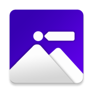

  

<h1 align="center">
  Retagged
</h1>

  See More. Travel More.

   
   
   

## What is Retagged and why do I care?

We have all been in a situation where we see a beautiful picture of a place posted by someone who you follow on Social Media. We also would like to visit that place. Oh, wait! It doesn't have a location posted with it and it doesn't even have a caption? Also, you don't want to DM them specifically to ask this, 'coz we all have that inner shyness and fear of getting left on seen'.

So, we decided to take a better step at helping humanity with this process. We have built an android app that recognizes the exact location of the place in the image you want to visit and recommends popular places near that location. Basically, we have your entire custom made trip planned.😏 

   

## What it does ?

Retagged is an efficient, custom-tailored travel app that combines Machine learning and Google Cloud API with Places API. Retagged helps you find those exact (**Retagging**) places from "those" images on Social media which does not have any info attached to it. We also suggest the most popular places visited by people around those places. This will help you save money by visiting places in a single trip or future trip planning.

## How we built it

* Started up by firing up the Android Studio. 🔥
* Then some flow diagram drawings on the whiteboard. 🖼
* Then comes the Google Cloud Engine with feature extraction.💪
* Detecting location from the image. 👻
* Geocoding and Reverse Geocoding here and there.♻
* Extracting and displaying that location.⚓️
* Making those custom recommendations based on the location retrieved 👀.
* Parsing that JSON 🥺
* Making UI elements and beautifying'em with Material Design.😎

## Challenges we ran into

Filtering out images based on location and discarding all the other images with no prominent landmark was great challenge for us. We both learned great deals about Google Cloud Platform and making a custom recommendations based on the radius/distance of that geolocation.

## Accomplishments that we're proud of

We have created a functional android app embedded with Machine Learning capabilities in a limited amount of time. AND IT WORKS ACCURATELY! 😳 Everyone tried new APIs and new tools for the first time on the project. 💪

## What's next for Retagged

* Develop Retagged with more robust ML algorithms.
* Develop a business models based on recommendations.
* Developing more features for the better User Experience.

******* 📣 Retagged is still evolving. *******

## Stay tuned 📢

